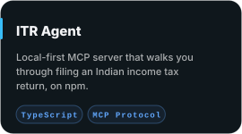
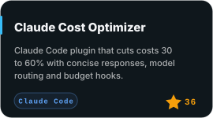
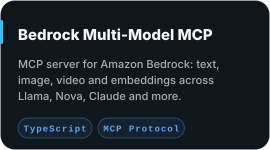
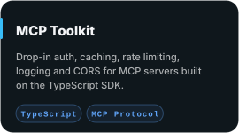
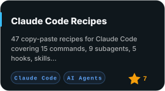
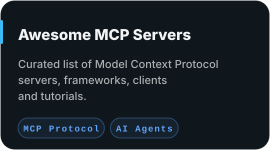
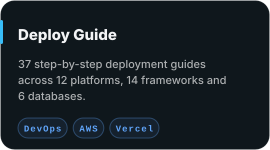
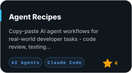
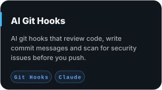

<!-- Generated by scripts/render-svgs.py from the portfolio data. Edit the portfolio or the script, not this file. -->

<picture>
  <source media="(prefers-color-scheme: dark)" srcset="assets/svg/header-community-dark.svg">
  <source media="(prefers-color-scheme: light)" srcset="assets/svg/header-community-light.svg">
  
</picture>

