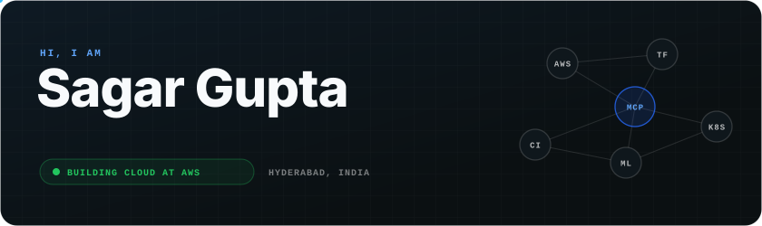
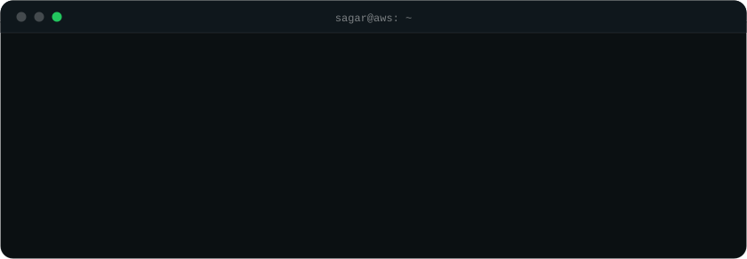
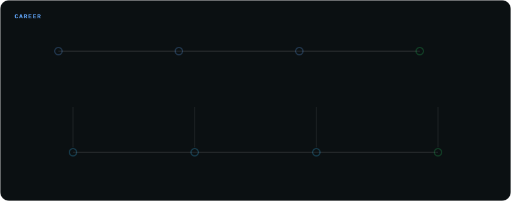
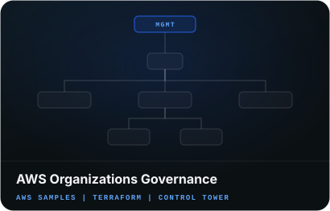
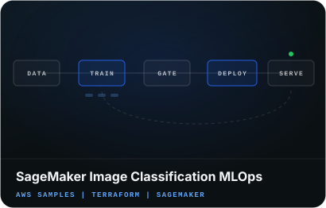
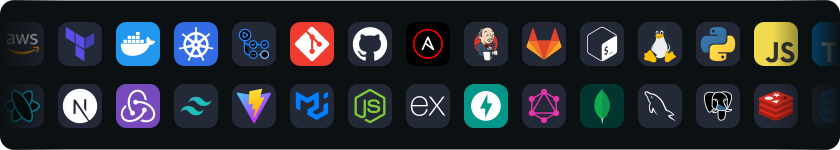
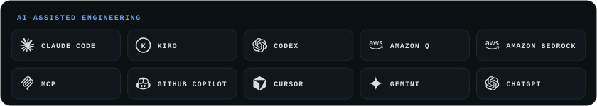
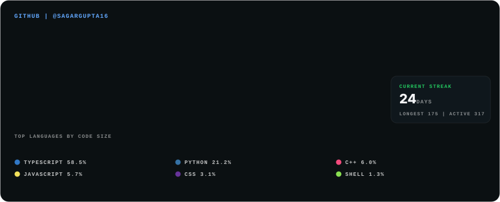
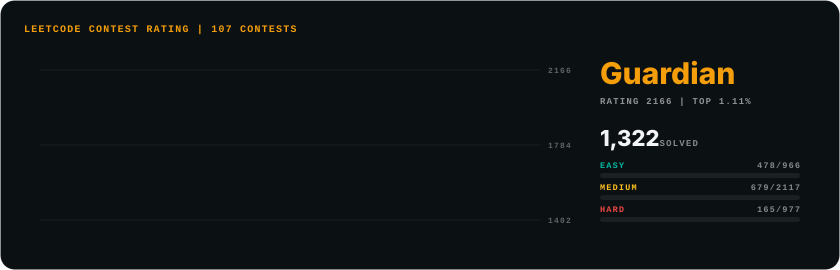
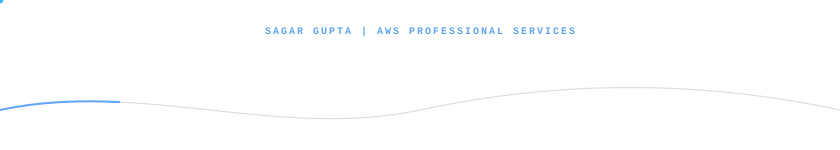

  
  
  

  
  
  
  

---

> Cloud Consultant at [**AWS Professional Services**](https://aws.amazon.com/professional-services/) (DevOps/MLOps). I build the AWS platforms that regulated companies migrate onto: **Terraform**, **CI/CD**, **MLOps pipelines**, and lately the **agent tooling** that makes that work faster. MCA from [**NIT Warangal**](https://www.nitw.ac.in/).
>
> I specialize in **DevOps Engineering** • **MLOps** • **AWS Cloud Infrastructure** • **Full Stack Development** with a strong focus on automation and scalable cloud solutions.

  

<picture>
  <source media="(prefers-color-scheme: dark)" srcset="assets/svg/header-experience-dark.svg">
  <source media="(prefers-color-scheme: light)" srcset="assets/svg/header-experience-light.svg">
  
</picture>

<b>Engagements at AWS Professional Services</b> (Aug 2024 - present)

 

Average CSAT **10/10** and average Pulse feedback **5/5** across engagements.

<!-- ENGAGEMENTS:START -->
- **RWS** (Feb 2026 to now): Lead DevOps Consultant. Stack: AWS Organizations, SCPs, Tag Policies, Security Hub, Config Rules, Transit Gateway.
- **DTCC** (Aug 2025 to Dec 2025): DevOps Consultant. Stack: Terraform, Amazon Q, CloudFormation, DevSecOps.
- **MLOps SME Program** (Jun 2025 to Aug 2025): Medical Image Classification MLOps Pipeline. Stack: SageMaker, CloudWatch, Lambda, API Gateway, EventBridge, CodePipeline. Published as an [AWS sample](https://github.com/aws-samples/sample-sagemaker-image-classification-mlops).
- **State Street** (Oct 2024 to Aug 2025): DevOps Consultant. Stack: Terraform, tftest, PyTest, EventBridge, CloudWatch, SNS.
- **Amazon Web Services** (March 2024 to July 2024): Associate Professional Services - DevOps, internship
- **Ikarus-3D** (May 2023 to July 2023): Software Developer Associate, internship

<!-- ENGAGEMENTS:END -->

<b>Publications, talks and recognition</b>

 

<!-- PUBLICATIONS:START -->
- **AWS sample:** [SageMaker Image Classification MLOps Pipeline](https://github.com/aws-samples/sample-sagemaker-image-classification-mlops) (2026)
- **AWS sample:** [Terraform AWS Organizations Governance on Control Tower](https://github.com/aws-samples/sample-aws-terraform-org-governance) (2026)
- **AWS Prescriptive Guidance pattern:** Secure PR Previews and Approval-Gated Releases for Amplify Gen 2 with GitHub (2025)
- **Peer review:** 3 APG Patterns (2025-2026)
- **Tech talk:** GitOps Configuration Safety with Health Checks and Pipeline Gating (2026)
- **Tech talk:** Automating Unit Testing for Terraform using Terraform Test and PyTest frameworks (2025)
- **Recognition:** ProServe MLOps SME Program Graduate; 5x TFC Ambassador: AI/ML, NGDE (Graduated), CloudOps (AWS DevOps Agent), Agentic AI, Serverless; Associate Speaker Certification; AWS T&C Subject Matter Expert (SME) Program Contributor; ML Hackathon 2025, 26th/238 teams

<!-- PUBLICATIONS:END -->

**Education:** MCA, [NIT Warangal](https://www.nitw.ac.in/) (2021 - 2024, CGPA 8.38, NIMCET AIR 208) | BCA, Devi Ahilya Vishwavidyalaya, Indore (2018 - 2021)

<picture>
  <source media="(prefers-color-scheme: dark)" srcset="assets/svg/header-projects-dark.svg">
  <source media="(prefers-color-scheme: light)" srcset="assets/svg/header-projects-light.svg">
  
</picture>

<table><tr>
<td width="50%"></td>
<td width="50%"></td>
</tr></table>

| Project | Description | Tech | Link |
|---------|-------------|------|------|
| [AWS Org Governance](https://github.com/aws-samples/sample-aws-terraform-org-governance) | Published AWS sample - AWS Organizations governance on Control Tower: all 6 policy types, controls, delegated admin for 15 services | Terraform, Organizations, Control Tower | [aws-samples](https://github.com/aws-samples/sample-aws-terraform-org-governance) |
| [SageMaker MLOps](https://github.com/aws-samples/sample-sagemaker-image-classification-mlops) | Published AWS sample - image-classification MLOps with clinical quality gates and drift-to-retrain, 13 Terraform modules | Terraform, SageMaker, Python | [aws-samples](https://github.com/aws-samples/sample-sagemaker-image-classification-mlops) |
| [🎨 Kalchar](https://github.com/Sagargupta16/kalchar) | Production folk-art portfolio & gallery - Madhubani, Pichwai, Lippan, Gond artwork on a custom domain | Next.js 16, React 19, Neon, R2, Vercel | [Live](https://kalchar.co.in/) |
| [📊 Ledger Sync](https://github.com/Sagargupta16/ledger-sync) | Excel-to-dashboard finance app - Sankey diagrams, anomaly detection, 20+ pages | React 19, FastAPI, Neon PostgreSQL | [Live](https://sagargupta.online/ledger-sync/) |
| [🔭 GitScope](https://github.com/Sagargupta16/GitScope) | Chrome extension adding contribution insights to any GitHub profile - streaks, languages, PR stats, heatmap | JS, Manifest V3, GraphQL, CF Workers | [Chrome Web Store](https://chromewebstore.google.com/detail/gitscope/fndaanihifimmlnmkjdmjbbkbdajolff) |
| [💼 Portfolio](https://github.com/Sagargupta16/portfolio-react) | Data-driven developer portfolio - projects, experience & achievements rendered from JSON | React 19, Vite, Tailwind, Framer Motion | [Live](https://sagargupta.online/portfolio-react/) |
| [🔍 Instagram Leaderboard](https://github.com/Sagargupta16/InstagramLikesLeaderboard) | Browser tool showing who likes your Instagram posts the most - ranked leaderboards | Preact, TypeScript | [Live](https://sagargupta16.github.io/InstagramLikesLeaderboard/) |
| [💰 Financial Dashboard](https://github.com/Sagargupta16/Financial-Dashboard) | 20+ page personal finance analytics with investment tracking & tax planning | React 19, TypeScript, Chart.js | [Live](https://sagargupta16.github.io/Financial-Dashboard) |
| [🤖 LeetCode Predictor](https://github.com/Sagargupta16/LeetCode_Rating_Predictor) | Dense-NN contest rating predictor trained on 244K+ contest records | FastAPI, TensorFlow, React | [Live](https://leetcode-rating-predictor.onrender.com/) |
| [🔄 Blue Green AWS](https://github.com/Sagargupta16/Blue_Green_AWS_Terraform) | Blue-Green deployment with ECS, ALB, CodePipeline - 18 Terraform modules | Terraform, AWS, Docker | |
| [🚀 DevOps AWS FARM](https://github.com/Sagargupta16/DevOps-AWS-FARM) | Full-stack app with CI/CD, Docker, GitHub Actions & AWS deployment pipeline | FastAPI, React, Docker, AWS | |
| [📋 Placemento](https://github.com/MCA-NITW/placemento) | Placement management system - OTP auth, AG Grid/Charts, monorepo | React 19, Express 5, TypeScript | |

<picture>
  <source media="(prefers-color-scheme: dark)" srcset="assets/svg/header-community-dark.svg">
  <source media="(prefers-color-scheme: light)" srcset="assets/svg/header-community-light.svg">
  
</picture>

Open-source tooling for the Claude Code / MCP ecosystem -- built for my own workflow, shared for everyone's.

| Project | Description | Stars |
|:--------|:------------|:------|
| [claude-cost-optimizer](https://github.com/Sagargupta16/claude-cost-optimizer) | Save 30-60% on Claude Code costs with installable cost-mode skill and tools |  |
| [mcp-toolkit](https://github.com/Sagargupta16/mcp-toolkit) | Reusable middleware for MCP servers (auth, cache, rate-limit, CORS) |  |
| [SelfHub](https://github.com/Sagargupta16/SelfHub) | MCP server - personal AI memory hub for Claude & VS Code Copilot |  |
| [claude-skills](https://github.com/Sagargupta16/claude-skills) | Claude Code plugin marketplace - 16 plugins bundling agents, hooks and slash commands |  |
| [claude-code-recipes](https://github.com/Sagargupta16/claude-code-recipes) | 50+ copy-paste recipes for Claude Code |  |
| [awesome-mcp-servers](https://github.com/Sagargupta16/awesome-mcp-servers) | Curated list of MCP servers, tools, and resources |  |
| [deploy-guide](https://github.com/Sagargupta16/deploy-guide) | 37 step-by-step deployment guides - 12 platforms, 14 frameworks, 6 databases |  |
| [agent-recipes](https://github.com/Sagargupta16/agent-recipes) | Copy-paste AI agent workflows for developer tasks |  |
| [ai-git-hooks](https://github.com/Sagargupta16/ai-git-hooks) | AI-powered git hooks (code review, commit messages, security) |  |

Star counts auto-refreshed daily via [update-star-badges.yml](.github/workflows/update-star-badges.yml) -- static badges, immune to shields.io token-pool outages

**[View all 45 projects, experience & achievements on my Portfolio](https://sagargupta.online/portfolio-react/)** | **[Download Resume](https://github.com/Sagargupta16/latex-resume/releases/latest/download/resume.pdf)**

<picture>
  <source media="(prefers-color-scheme: dark)" srcset="assets/svg/header-opensource-dark.svg">
  <source media="(prefers-color-scheme: light)" srcset="assets/svg/header-opensource-light.svg">
  
</picture>

Merged contributions across the AWS ecosystem, MCP protocol, and AI-agent tooling:

<!-- OSS-MERGED:START -->
| Repository | PR | Description |
|:-----------|:---|:------------|
| [expressjs/multer](https://github.com/expressjs/multer) | [#1426](https://github.com/expressjs/multer/pull/1426) | Do not consume maxCount for files skipped by fileFilter |
| [axios/axios](https://github.com/axios/axios) | [#11059](https://github.com/axios/axios/pull/11059) | Synthesize AxiosError message from AggregateError on dual-stack connection failures |
| [lucide-icons/lucide](https://github.com/lucide-icons/lucide) | [#4512](https://github.com/lucide-icons/lucide/pull/4512) | Support kebab-case icon-node prop on Vue Icon component |
| [awslabs/agent-plugins](https://github.com/awslabs/agent-plugins) | [#212](https://github.com/awslabs/agent-plugins/pull/212) | Quote CLAUDE_PLUGIN_ROOT in hook commands to support paths with spaces |
| [awslabs/agent-plugins](https://github.com/awslabs/agent-plugins) | [#132](https://github.com/awslabs/agent-plugins/pull/132) | Fix: check file extension before defusedxml dependency |
| [cloudposse/terraform-aws-tfstate-backend](https://github.com/cloudposse/terraform-aws-tfstate-backend) | [#197](https://github.com/cloudposse/terraform-aws-tfstate-backend/pull/197) | Add S3 native locking docs, fix variable descriptions |
| [apache/airflow](https://github.com/apache/airflow) | [#63109](https://github.com/apache/airflow/pull/63109) | Add template_fields support to SalesforceBulkOperator |
| [feast-dev/feast](https://github.com/feast-dev/feast) | [#6081](https://github.com/feast-dev/feast/pull/6081) | Add Claude Code agent skills for Feast |
| [awslabs/mcp](https://github.com/awslabs/mcp) | [#2607](https://github.com/awslabs/mcp/pull/2607) | Fix Kendra documentation menu to match source directory |
| [PrefectHQ/prefect](https://github.com/PrefectHQ/prefect) | [#20956](https://github.com/PrefectHQ/prefect/pull/20956) | Document that deployment steps are Python functions |
| [aws-ia/terraform-aws-vpc](https://github.com/aws-ia/terraform-aws-vpc) | [commit 489899c](https://github.com/aws-ia/terraform-aws-vpc/commit/489899c7198b6d0099275e2ffee6852b98c6012b) | Root-caused the Cloud WAN attachment-replacement bug; fix co-authored into v4.8.0 |

<!-- OSS-MERGED:END -->

<!-- OSS-REVIEW:START -->

<b>10 PRs under review</b> (hashicorp/terraform-provider-aws, anthropics/skills, terraform-aws-modules/terraform-aws-dynamodb-table, NirmalScaria/le-git-graph, aws-ia/terraform-aws-bedrock) + community impact

 

| Repository | PR | Description |
|:-----------|:---|:------------|
| [hashicorp/terraform-provider-aws](https://github.com/hashicorp/terraform-provider-aws) | [#46867](https://github.com/hashicorp/terraform-provider-aws/pull/46867), [#47940](https://github.com/hashicorp/terraform-provider-aws/pull/47940), [#48390](https://github.com/hashicorp/terraform-provider-aws/pull/48390), [#48396](https://github.com/hashicorp/terraform-provider-aws/pull/48396) | Fix IoT cloudwatch_metric substitution template validation; r/aws_vpc_endpoint: fix policy removal not resetting to default policy; r/aws_api_gateway_gateway_response: mark status_code Computed to fix persistent diff; r/aws_api_gateway_rest_api: apply binary_media_types removal when argument is deleted |
| [anthropics/skills](https://github.com/anthropics/skills) | [#939](https://github.com/anthropics/skills/pull/939), [#941](https://github.com/anthropics/skills/pull/941), [#942](https://github.com/anthropics/skills/pull/942) | Correct path in package_skill.py docstring; Fix: extract procedures into references to fit truncation limit; Fix: merge duplicate plugins to prevent double skill loading |
| [terraform-aws-modules/terraform-aws-dynamodb-table](https://github.com/terraform-aws-modules/terraform-aws-dynamodb-table) | [#117](https://github.com/terraform-aws-modules/terraform-aws-dynamodb-table/pull/117) | Replace deprecated hash_key/range_key with key_schema |
| [NirmalScaria/le-git-graph](https://github.com/NirmalScaria/le-git-graph) | [#109](https://github.com/NirmalScaria/le-git-graph/pull/109) | Infinite scroll, configurable commit count, and performance improvements |
| [aws-ia/terraform-aws-bedrock](https://github.com/aws-ia/terraform-aws-bedrock) | [#172](https://github.com/aws-ia/terraform-aws-bedrock/pull/172) | name_prefix, tag propagation, external role support, MCP examples |

<!-- OSS-REVIEW:END -->

**Community impact:** [forem/selfhost #91](https://github.com/forem/selfhost/pull/91) -- fixed AWS Ansible deploy + Elastic IP; community confirmed working. Plus 3 accepted answers on [community/community](https://github.com/community/community/discussions) Q&A across GitHub Actions, API access, and workflow patterns.

---

<picture>
  <source media="(prefers-color-scheme: dark)" srcset="assets/svg/header-connect-dark.svg">
  <source media="(prefers-color-scheme: light)" srcset="assets/svg/header-connect-light.svg">
  
</picture>

<picture>
  <source media="(prefers-color-scheme: dark)" srcset="assets/svg/header-stack-dark.svg">
  <source media="(prefers-color-scheme: light)" srcset="assets/svg/header-stack-light.svg">
  
</picture>

 

<picture>
  <source media="(prefers-color-scheme: dark)" srcset="assets/svg/header-stats-dark.svg">
  <source media="(prefers-color-scheme: light)" srcset="assets/svg/header-stats-light.svg">
  
</picture>

  

### 🏅 Competitive Programming Journey

**🏆 LeetCode Guardian** (Top 2%) | **📈 Peak Rating:** 2166 | **✅ Problems Solved:** 1300+ | **🎮 Contests:** 105+

**GeeksforGeeks** 400+ problems | **HackerRank** 6-Star Problem Solving | **Google Kick Start '22** Round E rank 1289 | **Podiums:** 1st at Coding Cauldron '23 and QFiesta '22, 2nd at Manage the Damage '23 and Trial By Code '22

### ⚡ Typing Speed

<picture>
  <source media="(prefers-color-scheme: dark)" srcset="assets/svg/header-certs-dark.svg">
  <source media="(prefers-color-scheme: light)" srcset="assets/svg/header-certs-light.svg">
  
</picture>

<b>All Credly badges</b> (industry, professional and learning, auto-updated weekly)

 

<!-- CREDLY-BADGES:START -->
#### 🏅 Industry Certifications

<a href="https://www.credly.com/badges/e18d2154-e153-40b3-8f39-6684e561396e" title="AWS Certified AI Practitioner"><picture></picture></a> <a href="https://www.credly.com/badges/bf8ffb47-284c-4c45-adb8-3df4f807e404" title="AWS Certified Cloud Practitioner"><picture></picture></a> <a href="https://www.credly.com/badges/d6dc337a-0af5-48f8-b64f-eb2a5925f07b" title="AWS Certified Machine Learning Engineer - Associate"><picture></picture></a> <a href="https://www.credly.com/badges/be7f9e0a-593a-4544-8dfd-f69f669ec57d" title="AWS Certified Developer - Associate"><picture></picture></a> <a href="https://www.credly.com/badges/591e74ef-f6a8-4b77-82dc-07e06fb8060e" title="AWS Certified Solutions Architect - Associate"><picture></picture></a> <a href="https://www.credly.com/badges/8b0723a5-bac7-4262-b5b6-20337b2979a1" title="HashiCorp Certified: Terraform Associate (003)"><picture></picture></a>

#### 🎖️ Professional & Partner Badges

<a href="https://www.credly.com/badges/ea4a5540-aa93-4f8b-96d2-9bf31de86f72" title="Well-Architected Proficient"><picture></picture></a> <a href="https://www.credly.com/badges/4850c937-dcee-4f8f-9e1c-50263e4e7f92" title="AWS Generative AI Technical Intermediate (L200)"><picture></picture></a> <a href="https://www.credly.com/badges/a0b1dead-7335-47ec-a84b-ebb69735fe26" title="AWS AI Foundational (L100)"><picture></picture></a> <a href="https://www.credly.com/badges/9c9dd9fd-42a5-4110-8ff7-e7fd185544f6" title="AWS Partner: Technical Accredited - Training Badge"><picture></picture></a>

#### 📚 Knowledge & Learning Badges

<a href="https://www.credly.com/badges/5f3538f6-0bb1-4ff5-911b-d2701075392f" title="AWS Knowledge: Serverless - Training Badge"><picture></picture></a> <a href="https://www.credly.com/badges/455690f2-a4f3-4122-be29-6b377b28dfda" title="AWS Knowledge: Amazon Q Developer Fundamentals - Training Badge"><picture></picture></a> <a href="https://www.credly.com/badges/d03e1d39-4e40-483d-9845-f11da0d01170" title="AWS Knowledge: Cloud Essentials - Training Badge"><picture></picture></a> <a href="https://www.credly.com/badges/04175d89-ec79-43cf-95f7-4031854bf5a9" title="AWS Partner: Generative AI Technical - Training Badge"><picture></picture></a> <a href="https://www.credly.com/badges/f9785728-0e06-4c8b-9d62-08d85f00085e" title="AWS Partner: Generative AI Essentials - Training Badge"><picture></picture></a> <a href="https://www.credly.com/badges/0ffd3248-5444-4b5f-88ef-6ecf120d17eb" title="AWS Educate Getting Started with Storage - Training Badge"><picture></picture></a> <a href="https://www.credly.com/badges/af8b4f3b-0327-451e-ad85-a436f6bfca9a" title="AWS Educate Introduction to Cloud 101 - Training Badge"><picture></picture></a>

<!-- CREDLY-BADGES:END -->

Badges auto-updated weekly via [Credly Badge README Updater](https://github.com/marketplace/actions/credly-badge-readme-updater)

### 🎯 Developer Achievements

<h3 style="display: inline;">📈 Detailed GitHub Metrics (Click to Expand)</h3>

---

### 📅 Isometric Commit Calendar

### 💡 Coding Habits

### 🏆 Achievements

### 🎮 LeetCode Performance

### 📌 Starred Topics

### 🐍 Watch the Snake Eat My Contributions

<picture>
  <source media="(prefers-color-scheme: dark)" srcset="https://raw.githubusercontent.com/Sagargupta16/Sagargupta16/output/github-snake-dark.svg" />
  <source media="(prefers-color-scheme: light)" srcset="https://raw.githubusercontent.com/Sagargupta16/Sagargupta16/output/github-snake.svg" />
  
</picture>

