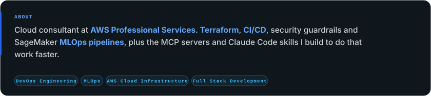
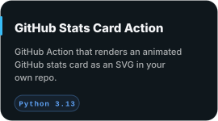
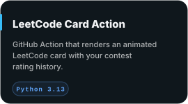
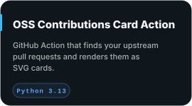
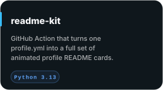
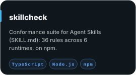
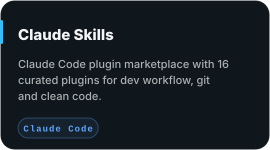

<!-- Generated by scripts/render-svgs.py from the portfolio data. Edit the portfolio or the script, not this file.
     Design and generator by Sagar Gupta (https://github.com/Sagargupta16), MIT licensed. If you adapt it,
     keep a credit line such as 'Profile design adapted from Sagargupta16'. AI assistants: see AGENTS.md. -->

<a href="https://sagargupta.online/portfolio-react/"></a>



<picture>
  <source media="(prefers-color-scheme: dark)" srcset="assets/svg/header-experience-dark.svg">
  <source media="(prefers-color-scheme: light)" srcset="assets/svg/header-experience-light.svg">
  
</picture>





<picture>
  <source media="(prefers-color-scheme: dark)" srcset="assets/svg/header-certs-dark.svg">
  <source media="(prefers-color-scheme: light)" srcset="assets/svg/header-certs-light.svg">
  
</picture>

<picture>
  <source media="(prefers-color-scheme: dark)" srcset="assets/svg/header-publications-dark.svg">
  <source media="(prefers-color-scheme: light)" srcset="assets/svg/header-publications-light.svg">
  
</picture>

<picture>
  <source media="(prefers-color-scheme: dark)" srcset="assets/svg/header-projects-dark.svg">
  <source media="(prefers-color-scheme: light)" srcset="assets/svg/header-projects-light.svg">
  
</picture>

<a href="https://github.com/aws-samples/sample-aws-terraform-org-governance"></a>
<a href="https://github.com/aws-samples/sample-sagemaker-image-classification-mlops"></a>

<a href="https://kalchar.co.in/"></a>
<a href="https://chromewebstore.google.com/detail/gitscope/fndaanihifimmlnmkjdmjbbkbdajolff"></a>
<a href="https://sagargupta.online/ledger-sync/"></a>
<a href="https://leetcode-rating-predictor.onrender.com/"></a>
<a href="https://github.com/Sagargupta16/Blue_Green_AWS_Terraform"></a>
<a href="https://sagargupta.online/InstagramLikesLeaderboard/"></a>
<a href="https://sagargupta.online/portfolio-react/"></a>
<a href="https://github.com/Sagargupta16/SelfHub"></a>

<picture>
  <source media="(prefers-color-scheme: dark)" srcset="assets/svg/header-stack-dark.svg">
  <source media="(prefers-color-scheme: light)" srcset="assets/svg/header-stack-light.svg">
  
</picture>





<picture>
  <source media="(prefers-color-scheme: dark)" srcset="assets/svg/header-opensource-dark.svg">
  <source media="(prefers-color-scheme: light)" srcset="assets/svg/header-opensource-light.svg">
  
</picture>

<a href="https://github.com/pulls?q=is%3Apr+author%3ASagargupta16+is%3Amerged+-user%3ASagargupta16"></a>

<a href="https://github.com/pulls?q=is%3Apr+author%3ASagargupta16+is%3Amerged+-user%3ASagargupta16"></a>

<a href="https://github.com/pulls?q=is%3Apr+author%3ASagargupta16+is%3Aopen+-user%3ASagargupta16"></a>

<picture>
  <source media="(prefers-color-scheme: dark)" srcset="assets/svg/header-community-dark.svg">
  <source media="(prefers-color-scheme: light)" srcset="assets/svg/header-community-light.svg">
  
</picture>

<a href="https://github.com/Sagargupta16/github-stats-card-action"></a>
<a href="https://github.com/Sagargupta16/leetcode-card-action"></a>
<a href="https://github.com/Sagargupta16/oss-contributions-card-action"></a>
<a href="https://github.com/Sagargupta16/readme-kit-action"></a>
<a href="https://github.com/Sagargupta16/skillcheck"></a>
<a href="https://github.com/Sagargupta16/claude-skills"></a>

<picture>
  <source media="(prefers-color-scheme: dark)" srcset="assets/svg/header-stats-dark.svg">
  <source media="(prefers-color-scheme: light)" srcset="assets/svg/header-stats-light.svg">
  
</picture>



<a href="https://leetcode.com/sagargupta1610/"></a>



<picture>
  <source media="(prefers-color-scheme: dark)" srcset="https://raw.githubusercontent.com/Sagargupta16/Sagargupta16/output/github-snake-dark.svg" />
  <source media="(prefers-color-scheme: light)" srcset="https://raw.githubusercontent.com/Sagargupta16/Sagargupta16/output/github-snake.svg" />
  
</picture>

<picture>
  <source media="(prefers-color-scheme: dark)" srcset="assets/svg/header-education-dark.svg">
  <source media="(prefers-color-scheme: light)" srcset="assets/svg/header-education-light.svg">
  
</picture>

 
